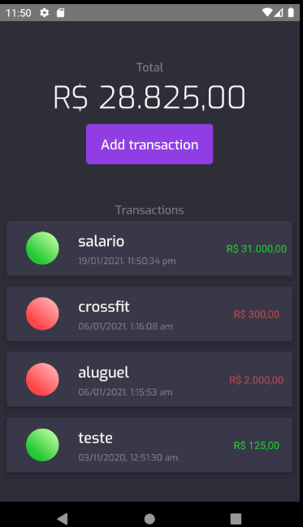
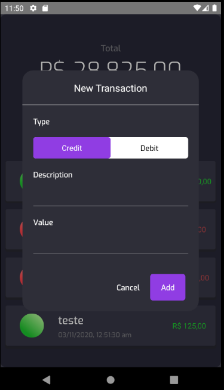

# Transactions APP


Ever though "hey, you know what the world is needing ? an expense tracker app!"

...Well, me neither, but I was bored and wanted to code something, so that's how this application was born



## Running the app


In order to run the app you must have the react native environemnt set up.


If you don't have it, you can see how to do it [here](https://reactnative.dev/docs/environment-setup).


And physical device to run your application.

Install the applications dependencies using: 

- Yarn:

```
    yarn
```
- NPM: 

```
    npm i 
```


Once your dependencies are installed,

you have to start the application

using the start script


and then, you have to use the react-native cli to run your app on your preferred platform

- Running it on android:

```
    react-native run-android
```

- Running it on IOS

```
    react-native run-ios
```

## Tests

This application was tested using 


[React native testing library](https://github.com/callstack/react-native-testing-library)


## Adding an expense 




To add a new expense you need to click on the add expense button,
then a modal will pop up.

Once the modal is on the screen, you can either add a credit or a debit.

Every transaction will be consisted in React native's async storage.

